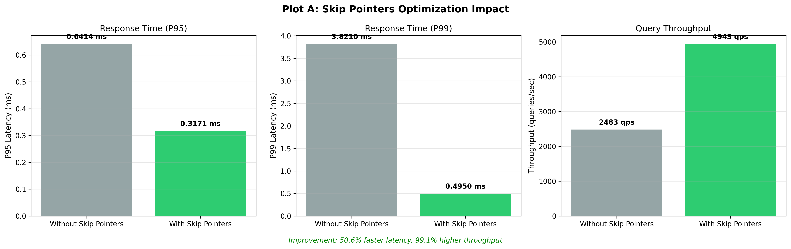
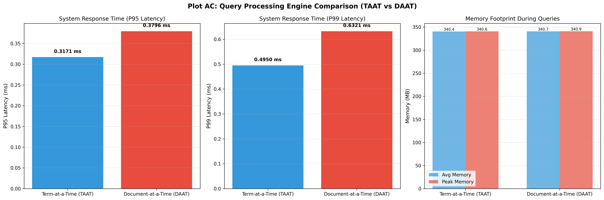
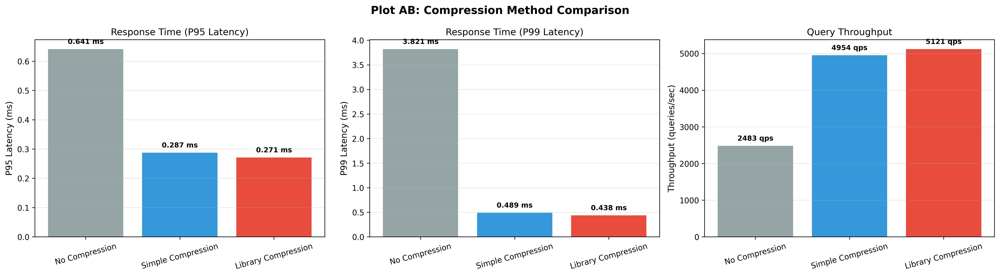
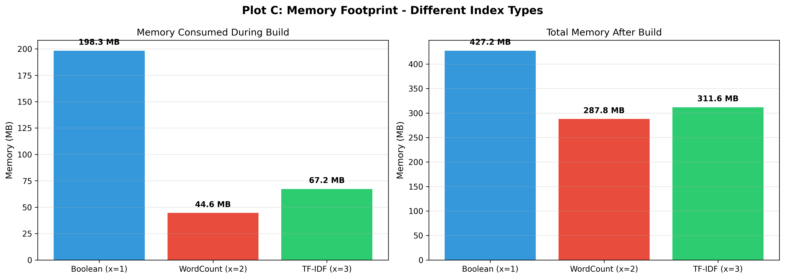
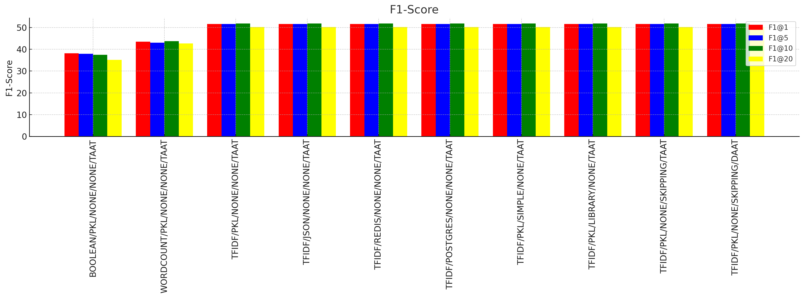
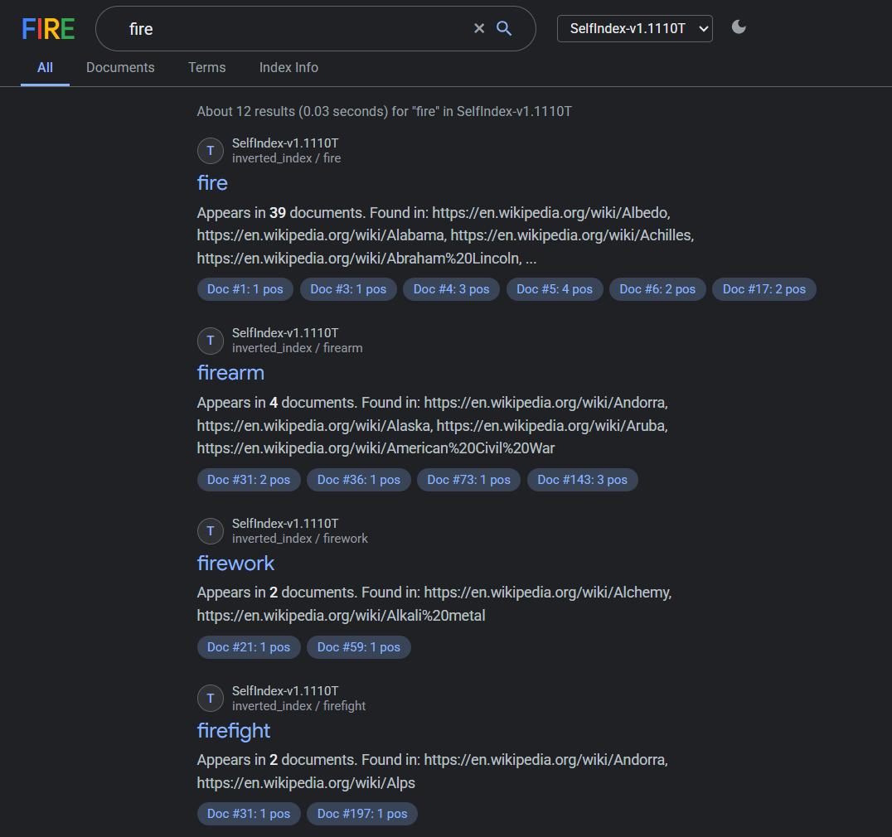

# FIRE: Fast Information Retrieval Engine 


## Overview

I built this custom information retrieval (IR) engine to experiment with inverted index construction, storage backend trade-offs, and query processing optimization. The primary goal was to construct a full-text search index from scratch and benchmark its performance against production-ready systems like Elasticsearch. We use large-scale Wikipedia and news datasets to test latency, throughput, and memory constraints under realistic loads.

## Core Features

- **Custom Inverted Index:** Handles text preprocessing through built-in tokenization, stop-word filtering, and stemming.
- **Query Execution Models:** Implements both Term-At-A-Time (TAAT) and Document-At-A-Time (DAAT) execution strategies to evaluate query planning trade-offs.
- **Boolean Logic Evaluation:** Parses and executes complex queries using `AND`, `OR`, `NOT`, and `PHRASE` operators with strict nested precedence.
- **Relevance Scoring:** Computes document relevance using Term-Frequency (TF) and TF-IDF metrics.
- **Postings Optimization:** Compresses postings lists to save memory and leverages skip pointers to speed up query intersection.
- **Storage Backends:** Benchmarks custom disk serialization against databases like PostgreSQL GIN, Redis, and RocksDB.
- **Performance Profiling:** Tracks 95th and 99th percentile query latency, read/write QPS, and memory footprint, using a standard Elasticsearch deployment as a baseline.

## Architecture

```text
src/
├── core/             # Base classes for indexers, documents, and storage interfaces
├── indexing/         # Inverted index implementations and database connections
├── preprocessing/    # NLP pipelines: Tokenization, Stemming, Stop-word filtering
└── querying/         # Query parsers, TAAT/DAAT execution engines, Boolean logic evaluators
```

## Benchmarks and Evaluation

We evaluated the performance of our indexing strategies across latency, throughput, memory footprint, and retrieval quality (F1-score).

### 1. Skip Pointers Optimization Impact

*Adding skip pointers significantly reduces $p_{95}$ and $p_{99}$ latency and boosts query throughput for Boolean retrieval.*

### 2. Query Processing Engine (TAAT vs DAAT)

*Term-at-a-Time (TAAT) demonstrates lower latency compared to Document-at-a-Time (DAAT), with a similar memory footprint.*

### 3. Compression Method Comparison

*Compression schemes drastically improve read throughput and reduce latency by keeping more of the postings list in memory/cache.*

### 4. Memory Footprint by Index Type

*Boolean indexes consume significantly more memory due to exact positional postings, whereas WordCount and TF-IDF require less overhead.*

### 5. Retrieval Quality (F1-Score)

*Comparison of F1-Scores across different ranking strategies and underlying datastores.*

## Getting Started

You will need Python 3.8+ and a running Elasticsearch instance (local or via Docker) to execute the benchmarking suite.

### Installation

Clone the repository and install the required dependencies:

```bash
git clone https://github.com/your-username/Custom-Search-Engine.git
cd Custom-Search-Engine
pip install -r requirements.txt
```

### 🖥️ Running the Web UI Demo

You can run a self-contained visual demo that builds the indexes and launches a Google-style search interface:

```bash
# 1. Build the sample indexes (streams 200 real Wikipedia articles)
python build_demo_indexes.py

# 2. Start a local web server
python -m http.server 8080

# 3. Open your browser and go to:
# http://localhost:8080/index_viewer/index.html
```

#### FIRE Search Interface

Our custom index is accompanied by a sleek, Google-inspired frontend designed with both dark and light modes. 

**The Landing Page:**

*A minimalist, centralized search portal that allows users to instantly query the locally built custom indexes. It features a dropdown to select between different ranking models (Boolean, TF, TF-IDF).*

**The Results Page:**

*The highly optimized results interface renders search results in sub-milliseconds. It features advanced drill-down capabilities with dedicated tabs for filtering by **Documents**, raw **Terms**, and viewing the internal **Index Info**. Each search result provides the document's URL (or ID), the parsed title, and a generated text snippet mimicking modern search engines.*

### Usage

The following commands represent the standard workflow for ingesting data and running queries.

**1. Indexing Data**

To build a new index and run evaluations, execute the desired indexing module directly. We use a specific naming convention `self_index_v1_xyziq.py` to define the index configuration:
* **`x`**: Information Indexed (1=Boolean, 2=Word counts, 3=TF-IDF)
* **`y`**: Datastore (1=Local custom, 2=Off-the-shelf DB)
* **`z`**: Compression (1=Simple, 2=Off-the-shelf library)
* **`i`**: Index Optimization (0/1 for skip pointers)
* **`q`**: Query Engine (`T` for TAAT, `D` for DAAT)

*Note on Data:* The scripts automatically load the Wikipedia dataset using the `datasets` library from HuggingFace (`20231101.en` split). The News dataset should be placed locally in `data/data/News_Datasets/` (downloaded from webz.io). You do not need to pass data paths as arguments.

For example, to run a basic TAAT boolean index configuration (`1110T`):

```bash
python -m src.indexing.self_index_v1_1110T
```

**2. Running Queries**

Execute a boolean search against the built index:

```bash
python -m src.querying --query '("Apple" AND "Banana") OR ("Orange" AND NOT "Grape")'
```
